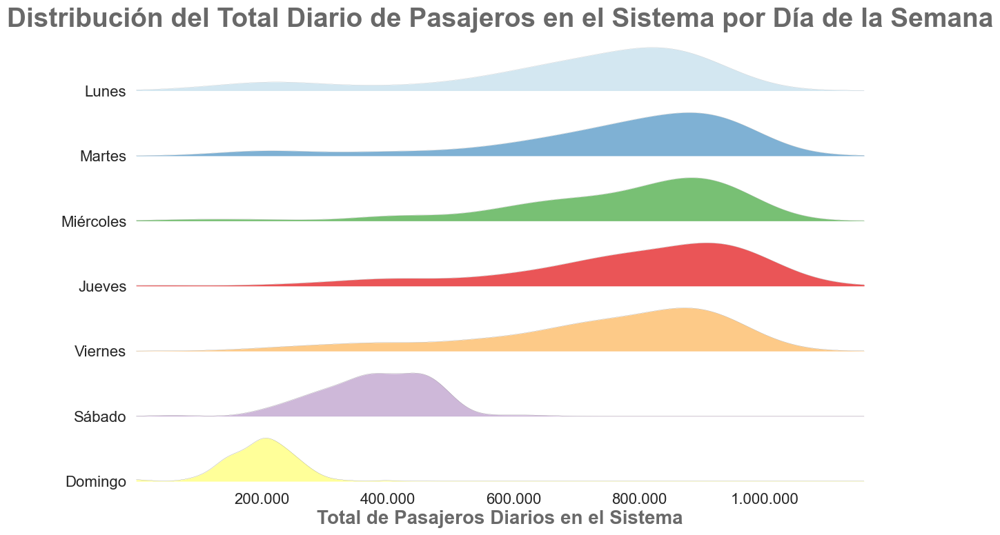

# 📊 Análisis Exploratorio de Datos (EDA) – SubteBA 2022–2024

Este repositorio contiene el análisis exploratorio realizado sobre los datos históricos de pasajeros del sistema de subterráneos de Buenos Aires (SubteBA) para el período 2022–2024.

---

## 📦 Contenido

1. **Carga y consolidación de datos**
2. **Limpieza y normalización**
3. **Enriquecimiento con variables externas (clima y feriados)**
4. **Análisis exploratorio con visualizaciones**
5. **Generación de datasets agregados para modelado predictivo**

---

## 📚 Datos y Origen

- **Fuente primaria:** [Datos Abiertos Ciudad de Buenos Aires](https://data.buenosaires.gob.ar/)
    - Registros de pasajeros cada 15 minutos por molinete.
    - Dos archivos `.csv` por mes (líneas ABC y DEH).
    - Total: **72 archivos para 2022–2024** (~40M registros).
---

## 🛠 Proceso de Trabajo

### 1️⃣ Carga y Consolidación 📤
Se procesaron los 72 archivos `.csv`, que presentaban:
- Codificaciones mixtas (`utf-8-sig`, `latin1`).
- Datos en formato semi-estructurado (una columna con delimitadores `;`).
- Columnas faltantes o variables inconsistentes.

📌 **Solución aplicada:**
- Intento de lectura con `utf-8-sig`, fallback automático a `latin1`.
- Limpieza de caracteres extra (`"`) y separación de campos.
- Validación para incluir sólo archivos con columnas clave:
  - `FECHA`, `ESTACION`, `LINEA`, `pax_TOTAL`.

El resultado consolidado se guardó en `.parquet` para mejorar el rendimiento.

---

### 2️⃣ Limpieza y Normalización 🧹
- Conversión de tipos:
  - `FECHA` → datetime
  - `ESTACION`, `LINEA` → categorías
  - `pax_TOTAL` → numérico
- Manejo de valores nulos y datos erróneos.
- Ordenamiento cronológico.

---

### 4️⃣ Agregación Σ
Para facilitar el análisis:
- Agrupación por `FECHA`, `LINEA`, `ESTACION` → suma de pasajeros (`pax_TOTAL`).
- Reducción de **40M registros** a **~97K observaciones**.

---

### 5️⃣ Análisis Exploratorio  📊
📌 Insights: 
## - Distribucion simil a un binominal debido a la baja frecuencia en fin de semanas

### - Menor demanda los fin de  semanas, se puede observar gracias a la distribución  de los diferentes días de la semana

## - Algunos outliers en especial los día de semana, esto se puede deducir que es debido a los feriados o paros de trasporte

## - Las líneas mas utilizadas son la B y D hasta 2024 que la Línea D entro en obras durante los meses de Enero y Febrero, luego de las obras el flujo de pasajeros se equipara al de la Línea A
## - Efecto estacional con caídas en meses de vacaciones (Enero y Febrero).

## - En promedio las lineas B, D y A son las que mas pasajeros trasportan

---
### 6️⃣ Análisis Geoespacial y Visualización Interactiva 🗺️

Se incorporaron coordenadas geográficas a las estaciones mediante un proceso de limpieza y normalización de nombres, complementado con fuzzy matching para corregir inconsistencias.

Con esta información, se generó un **mapa interactivo** con Folium que permite visualizar:

-   El flujo promedio diario de pasajeros por estación representado con círculos cuyo tamaño es proporcional al volumen de pasajeros.
    
-   Las líneas de subte conectando estaciones geográficamente ordenadas.
    
-   Popups y tooltips con información detallada de cada estación y línea.
    
-   Una leyenda y título fijos para mejorar la experiencia visual.
    
Este mapa facilita la comprensión espacial del flujo de pasajeros y permite identificar patrones y puntos clave en la red del SubteBA.

---

